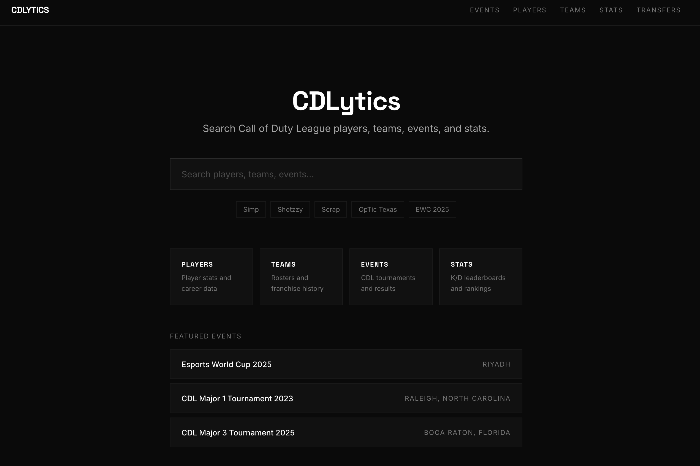
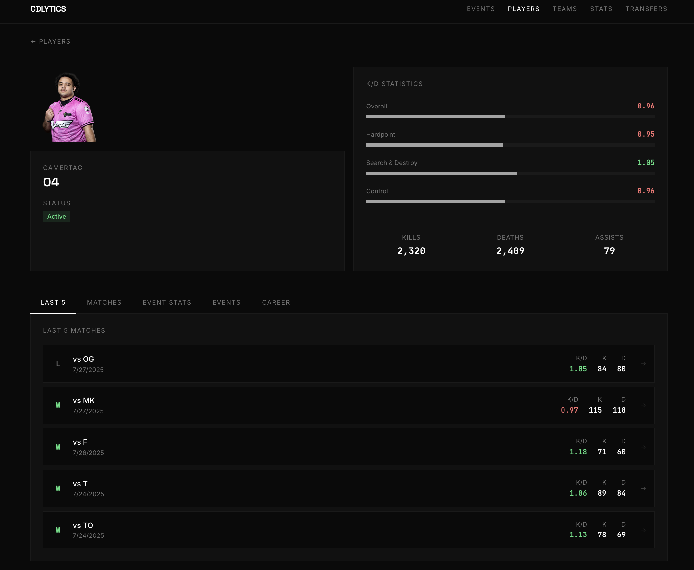
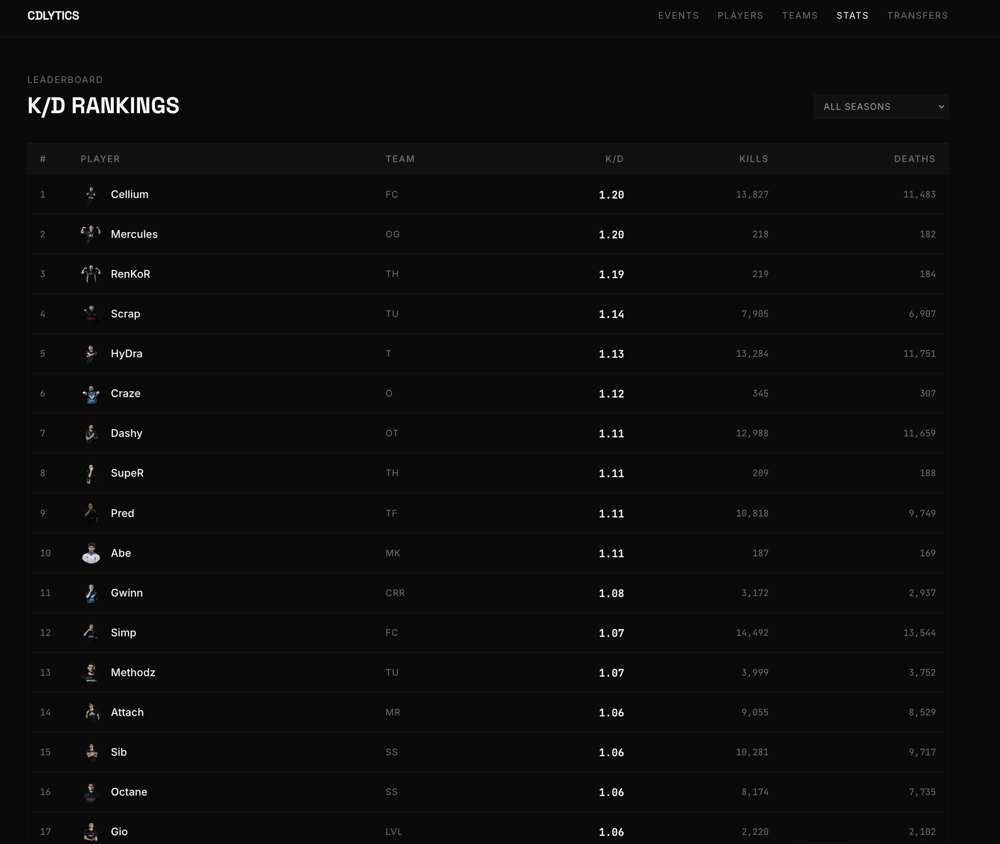
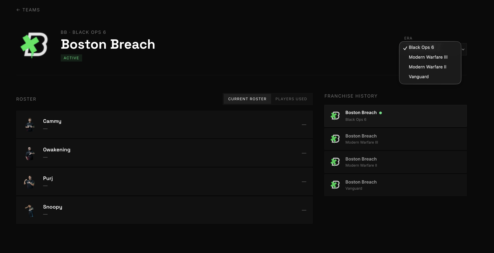
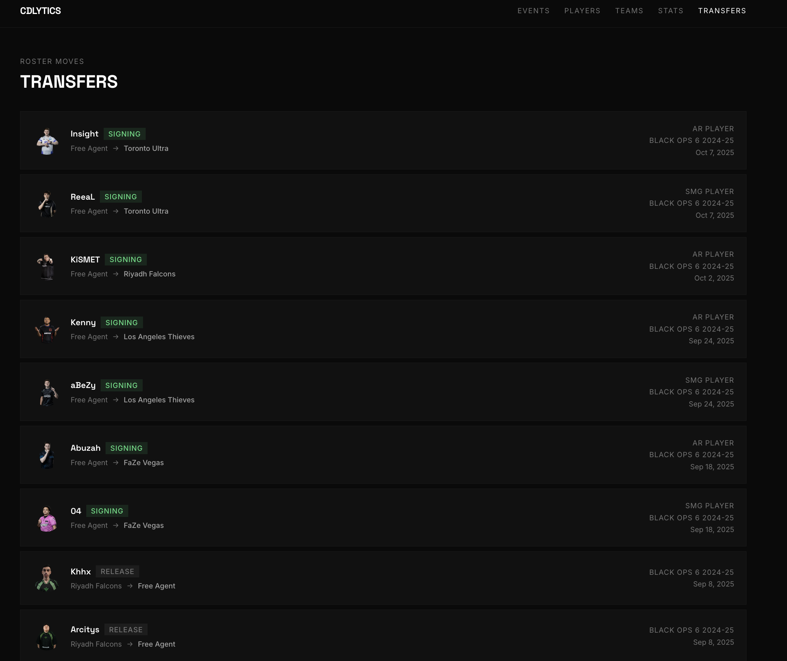

# CDLytics

Full-stack Call of Duty League analytics platform covering five competitive seasons (Black Ops Cold War through Black Ops 6). Built end-to-end as a solo project ; backend API, React frontend, and full AWS infrastructure provisioned with Terraform.

Live at **[cdlytics.com](https://cdlytics.com)**

## Stack

| Layer | Tech |
|-------|------|
| Frontend | React 19, TypeScript, Vite, Tailwind CSS, React Router |
| Backend | Go (Gin), GORM, PostgreSQL |
| Infrastructure | AWS (ECS Fargate, RDS, CloudFront, S3, ECR, ALB, Secrets Manager) |
| IaC | Terraform |
| CI/CD | GitHub Actions |
| Containerization | Docker |

## Features

- **K/D leaderboards** filterable by season and map type, with server-side pagination and search
- **Player profiles** with cross-season stat history and match logs
- **Team rosters** with season-by-season breakdowns
- **Tournament brackets** — custom canvas-based renderer that adapts layout per event format (single-elim, group stage, EWC format)
- **Events system** — full event pages with hero, standings, match results, bracket view, and team/stat tabs
- **Transfer history** — chronological player movement across all five seasons
- **Rate limiting** with sliding-window logic and `X-Forwarded-For` parsing behind CloudFront
- **Live event strip** surfacing in-progress events on the home page

## Screenshots

### Home



The landing page is built around a single global search that resolves players, teams, and events from one box, with quick-pick chips (`Simp`, `Shotzzy`, `Scrap`, `OpTic Texas`, `EWC 2025`) for common queries. Four category cards route into Players, Teams, Events, and Stats, and a **Featured Events** strip surfaces marquee tournaments (Esports World Cup 2025 — Riyadh, CDL Major 1 2023 — Raleigh, CDL Major 3 2025 — Boca Raton) with their host cities.

### Player profile



Each player page pairs an identity card (gamertag, active status, avatar) with a **K/D Statistics** panel that breaks performance down by game mode — Overall, Hardpoint, Search & Destroy, and Control — each value color-coded above/below 1.0 with a relative bar. The mode splits are computed live by aggregating per-map kills/deaths joined to `match_maps.mode`, so they're accurate for every season (including eras that ship no pre-aggregated stats). Below, tabs for **Last 5 / Matches / Event Stats / Events / Career** drive a match log showing per-series result, K/D, kills, deaths, and date.

### K/D rankings



The Stats page is a server-paginated, season-filterable leaderboard (the **All Seasons** dropdown scopes to any single era). Rows rank players by K/D with kills and deaths alongside, and the K/D column is color-graded so the top of the board reads at a glance.

### Team page — era switching, rosters & franchise history



Teams are modeled per era (one row per franchise per game), so a team page carries an **ERA** dropdown that re-scopes the whole view to any season the franchise played — Boston Breach here switches between Black Ops 6, Modern Warfare III, Modern Warfare II, and Vanguard. The roster shows the selected era's lineup as player cards with a **Current Roster / Players Used** toggle ("current" is the lineup from the most recent played match; "players used" expands to everyone who logged a map that era), while the **Franchise History** rail on the right lists every era with the active one marked. Because eras stay linked to one franchise, rebrands and relocations remain connected rather than fragmented.

### Transfers



The Transfers page is a chronological feed of roster moves across all five seasons. Each entry tags the move type (**SIGNING** / **RELEASE**), the from → to teams, the player's role (AR / SMG), the season, and the date — e.g. Insight and ReeaL signing to Toronto Ultra for Black Ops 6 2024-25.

## Architecture

```
┌─────────────────────────────────────────────────────────────┐
│  CloudFront CDN                                             │
│    ├── /api/*  → ALB → ECS Fargate (Go API, Docker)        │
│    └── /*      → S3 (React SPA, static assets)             │
└─────────────────────────────────────────────────────────────┘
         │
         ▼
    RDS PostgreSQL (private subnet, not internet-exposed)
```

The API and frontend are decoupled — the Go server handles all `/api/v1/*` routes and the React app is served as a static build from S3. CloudFront routes between them so both share a single domain with no CORS overhead.

Infrastructure is split into Terraform modules (network, ECR, RDS, ALB, ECS, frontend), each independently plannable.

## Project Structure

```
├── cmd/
│   ├── main.go              # API server entry point
│   └── seed/main.go         # One-time database seeder (reads CSV data)
├── internal/
│   ├── database/            # GORM models and DB connection
│   └── handlers/            # Gin route handlers + tests
├── frontend-react/          # React + TypeScript SPA
│   └── src/
│       ├── components/      # Page and feature components
│       │   └── events/      # Full events feature (bracket, group stage, hero, tabs…)
│       ├── hooks/           # Custom React hooks
│       ├── services/        # API client (api.ts)
│       └── types/           # Shared TypeScript types
├── infrastructure/          # Terraform modules (AWS)
│   └── modules/
│       ├── network/         # VPC, subnets, security groups
│       ├── ecr/             # Docker image registry
│       ├── database/        # RDS PostgreSQL
│       ├── alb/             # Application Load Balancer
│       ├── ecs/             # Fargate cluster + service definition
│       └── frontend/        # S3 + CloudFront + ACM + Route53
├── database/                # CSV source data (CDL match records)
└── deploy/deploy.sh         # End-to-end deploy script
```

## Local Development

```bash
# Backend
go run cmd/main.go

# Frontend
cd frontend-react
npm install
npm run dev
```

The Vite dev server proxies `/api/*` to CloudFront by default. To point at a local backend:

```bash
# frontend-react/.env
VITE_API_URL=http://localhost:8080/api/v1
```

## Deploying

Prerequisites: AWS CLI configured, Terraform >= 1.9, Docker, jq

```bash
# First deploy — provisions infrastructure and seeds the database from CSV
SEED=true ./deploy/deploy.sh

# All subsequent deploys
./deploy/deploy.sh
```

The script runs `terraform apply`, builds and pushes the Docker image to ECR, forces a new ECS task deployment, builds the React frontend, and syncs it to S3 with cache invalidation.

## Testing

```bash
# Go unit + integration tests
go test ./...

# Frontend component tests (Vitest)
cd frontend-react && npm test
```

## Data

Season data sourced from CDL match records:

| Season | Game |
|--------|------|
| 2024-25 | Black Ops 6 |
| 2023-24 | Modern Warfare III |
| 2022-23 | Modern Warfare II |
| 2021-22 | Vanguard |
| 2020-21 | Black Ops Cold War |
